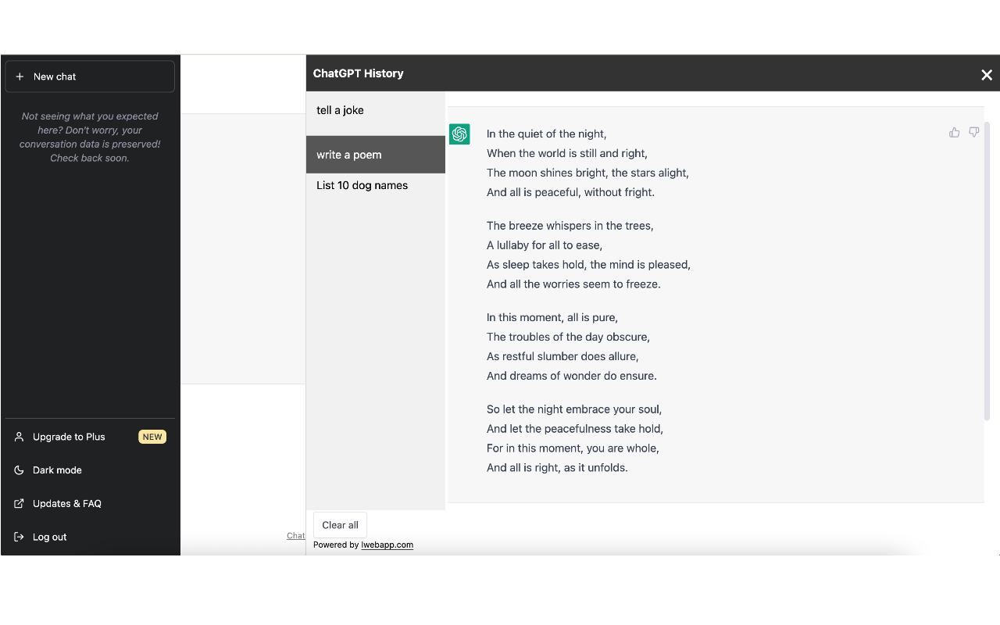
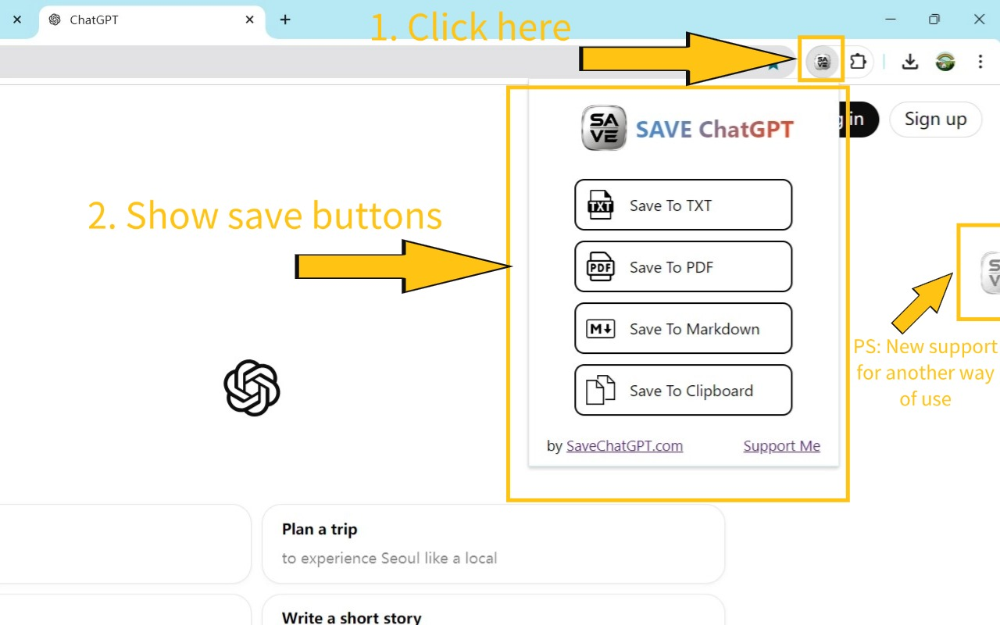

# ChatHistoryBox 浏览器插件

一款智能保存AI对话记录的Chrome扩展程序

## 📦 功能特性
- **智能检测**：自动识别常见AI聊天界面
- **一键保存**：通过悬浮按钮快速保存对话
- **单一格式支持**：JSON保存格式
- **本地存储**：数据直接保存到用户设备

```json
{
  "platform": "DeepSeek", // 标识对话平台来源
  "messages": [ // 对话消息数组
    {
      "type": "user", // 消息类型（用户提问）
      "content": "微信公众号文章的网址是什么", // 用户原始问题
      "timestamp": "2025-02-24T05:55:04.543Z" // ISO 8601时间戳（注意年份2025可能是测试数据）
    },
    {
      "type": "assistant", // 消息类型（AI回复）
      "content": "已深度思考（用时 0 秒）", // 简版回复文本
      "details": "<div...>", // 包含SVG图标的HTML格式渲染内容（用于展示思考过程）
      "thinkingTime": "0" // 系统处理耗时（秒）
    }
  ]
}
```

## TODOs
- [x] 点击悬浮按钮，然后弹出"保存此页面对话"，点击此按钮然后就保存成功。
- [ ] 对话记录保存页面（我想知道，可以如何获取当前跟AI对话页面的聊天记录？）
- [ ] 数据以文件的形式，保存在用户的本地文件管理器中。具体的形式用户可选，比如保存称为json文件，或者markdown文件。

## 参考案例



[ChatGPT_2025-02-23-12-23-20.md](Resource/ChatGPT_2025-02-23-12-23-20.md)

## 🛠 技术架构
```bash
ChatHistoryBox/
├── manifest.json        # 插件配置清单
├── popup.html           # 格式选择弹窗，用户界面
├── service-worker.js    # 后台服务核心逻辑
├── content-script.js    # 页面脚本注入
└── icons/               # 插件图标集
```

## 📍 使用说明

### 基本操作流程
1. 访问AI聊天网站（如DeepSeek）
2. 页面右下角出现💾按钮
3. 点击按钮自动保存对话记录
4. 文件下载到本地默认下载目录

### 高级功能
- **格式切换**：通过插件弹窗选择保存格式
- **批量保存**：支持连续多次保存不同对话
- **时间戳命名**：自动生成包含保存时间的文件名

## 问题分析
需要补充以下信息才能继续开发：
1. 请提供目标网站（如DeepSeek）的对话界面HTML结构示例，我需要根据实际DOM结构调整选择器✅

2. 是否需要支持多个AI服务（ChatGPT/Claude等）的对话保存？需要为每个服务编写特定的提取逻辑

3. 保存时是否需要包含元数据（如对话时间、模型版本等）？

建议下一步：

1. 先实现JSON格式的保存功能

2. 添加成功保存的反馈提示

3. 开发历史记录管理界面

4. 实现与Swift应用的数据同步机制
请告诉我你希望优先实现哪个部分，或者需要调整现有方案中的哪些设计。
